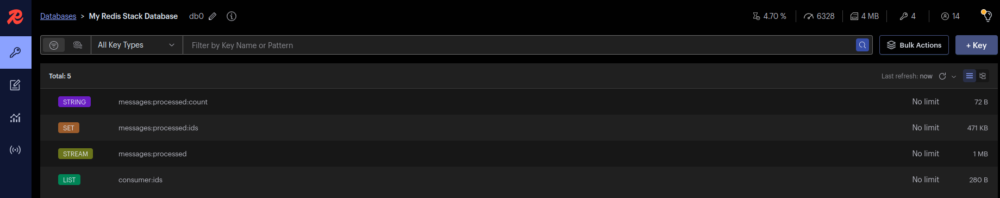
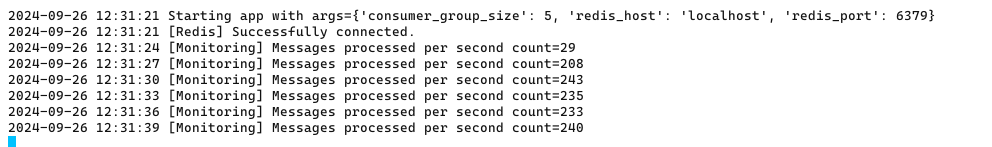

# Redis Consumer Group Application

This project uses Python to create a consumer group that processes messages from Redis Pub/Sub. It shows how multiple consumers can efficiently handle messages from a Redis channel at the same time.

## Application Overview

Here are some visual representations of the application in action:

### Redis Insights Dashboard



This image shows the Redis Insights dashboard, providing a real-time view of the Redis server's performance and the consumer group's activity.

### CLI Application in action



This screenshot displays the command-line interface of our application, showcasing multiple consumers processing messages concurrently.

## Features

- Multiple consumers running concurrently
- Redis connection with retry and error handling
- Command-line argument parsing for easy configuration
- Message processing simulation
- Active consumer ID management

## Requirements

- Python 3.9+
- Redis server
- Required Python packages

## Installation

1. Clone the repository:
   ```
   git clone https://github.com/yourusername/redis-consumer-group.git
   cd redis-consumer-group
   ```

2. Create and activate a virtual environment:
   ```
   python -m venv .venv
   source .venv/bin/activate
   ```

3. Install the required packages:
   ```
   pip install -r requirements.txt
   ```

4. Run unit tests:
   ```
   make unit-test
   ```

## Usage

1. Start the Redis server using Docker:
   ```
   make run-redis
   ```

2. Start the consumer group application (Terminal 1):
   ```
   python consume.py [--consumer-group-size <size>] [--redis-host <host>] [--redis-port <port>]
   ```
   You can adjust the number of consumers and Redis connection details as needed. The parameters are:
   - `--consumer-group-size`: Number of consumers in the group (default: 3)
   - `--redis-host`: Redis server hostname (default: localhost)
   - `--redis-port`: Redis server port (default: 6379)

   You can run the script without specifying these parameters, in which case the default values will be used:
   ```
   python consume.py
   ```

   Example specifying all parameters:
   ```
   python consume.py --consumer-group-size 5 --redis-host redis.example.com --redis-port 6380
   ```

3. Run the publisher script to push events (Terminal 2):
   ```
   source .venv/bin/activate
   python scripts/publisher.py
   ```

4. (Optional) Monitor the application progress using Redis Stack with Insights:
   ```
   make run-redis-stack
   ```
   Then open a web browser and navigate to `http://localhost:8001` to access the Redis Insights dashboard.

5. To stop the application, press Ctrl+C in Terminal 1. This will gracefully shut down the consumer group application.

6. To stop the publisher, press Ctrl+C in Terminal 2.

Note: Make sure to stop and remove the Docker containers when you're done.
